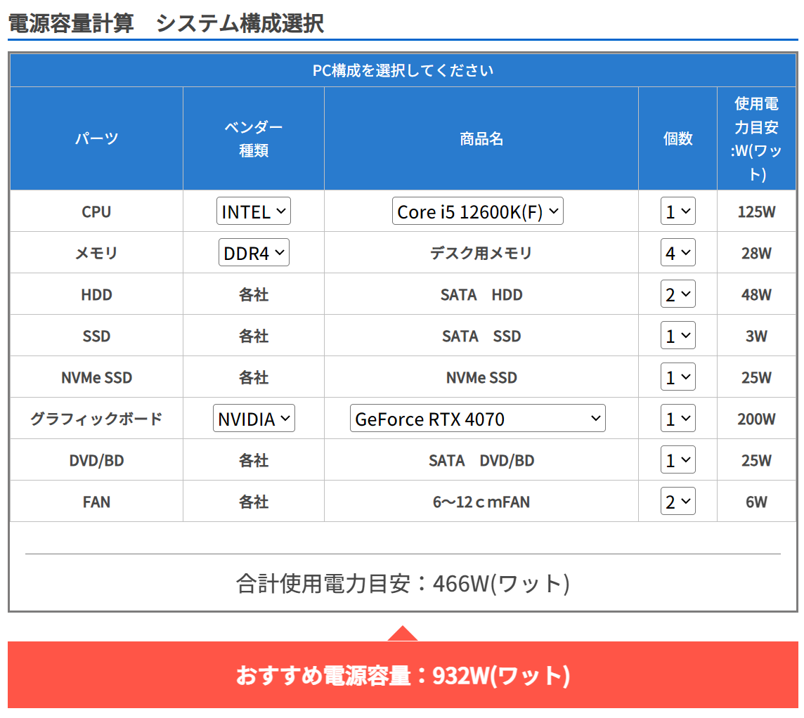
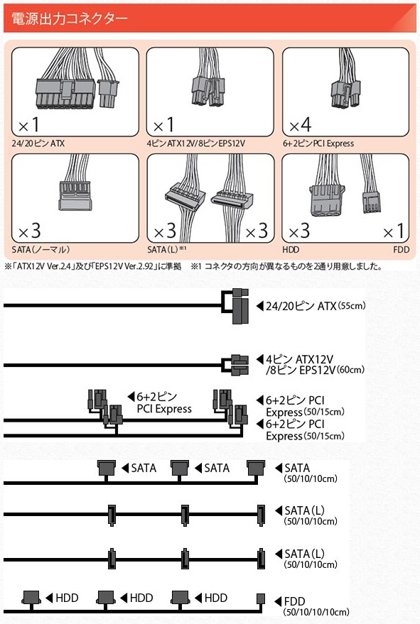

## 電源ユニットの入替

PC を起動したまましばらく離席していると、スリープになるでもなく電源が落ちてしまっていた。  
その後、電源スイッチを長押ししたりしても無反応で、しばらく時間を置いて電源が入るようになっても5分ほどで電源が落ちてしまう。

電源ケーブルの抜き差しやスイッチの Off/On 、コンセントの変更など、  
外側から簡単に確認できる範囲の切り分けを行い、挙動が変わらないことを確認したので、  
「ケース購入時点から使っていて15年以上交換してないし、これは電源ユニットの故障かな・・・」と断定して、交換してみることにした。

## 電源ユニットの選定

金額は1万円くらいで、現状利用している ATX ケース用電源 750W と互換性があるものくらいで緩く探した  
そこまでこだわりもなく、玄人志向で 750W の 80PLUS SILVER 製品が Amazon で翌日配送可能になっていたのでそのまま購入。  
[KRPW-AK750W/88+](https://www.kuroutoshikou.com/product/detail/krpw-ak750w-88-.html)

サイズは 150 x 140 x 86 mm で、現在のものよりも若干コンパクト。  
保証期間は3年となっており、以前の部品はずいぶん長持ちしたんだな・・・という気持ちに。

現在の構成だと 750W は心許ない感じもするが、最大容量で 62% くらいならまぁ許容かな。  
これ以上ハイスペックな部品を積んだり HDD を増やさない限りは問題無さそう。

## 配線

ケーブルはさすがに潤沢で、 SATA や PCI Express は使いどころ無くて大量に余っている。  
HDD はポン付けのファンで1口使ったが、FDD はさすがに今後使いどころが無くなっていくだろうな。。。  

ケーブル長も比較的余裕があったので、エアフローに影響の少ないケースの空きスペースにまとめて整理した。
HDD ケーブルからポン付けのファンを外すのに1番時間がかかったが、全体で30分ほどで入替完了。

## 入替後の動作

突然電源が落ちることは無くなったので、やはり電源ユニットの故障で間違いなかったらしい。  
交換後に事象が改善しなかったらどうしようと思っていたのでほっとした。

気持ち静音化して、動作もキビキビしているように感じる。  
画像生成しているときに GPU でやたら回転音がするようになってしまったが、これは今回の交換と何か関係あるのかな・・・？  
生成の進捗表示に合わせて小刻みな回転音が発生していて、どういう仕組みなんだ？となっている。このまましばらく様子見。

しかし、電源ユニットの故障は切り分けが難しいように感じた。  
本来はチェッカーを持っていれば検査して確実に判断することができるのだろうか？

電源供給不良でファンが動かず CPU が高温になるなど、電源故障といってもバリエーションが様々あるから難しそうな気はする。
