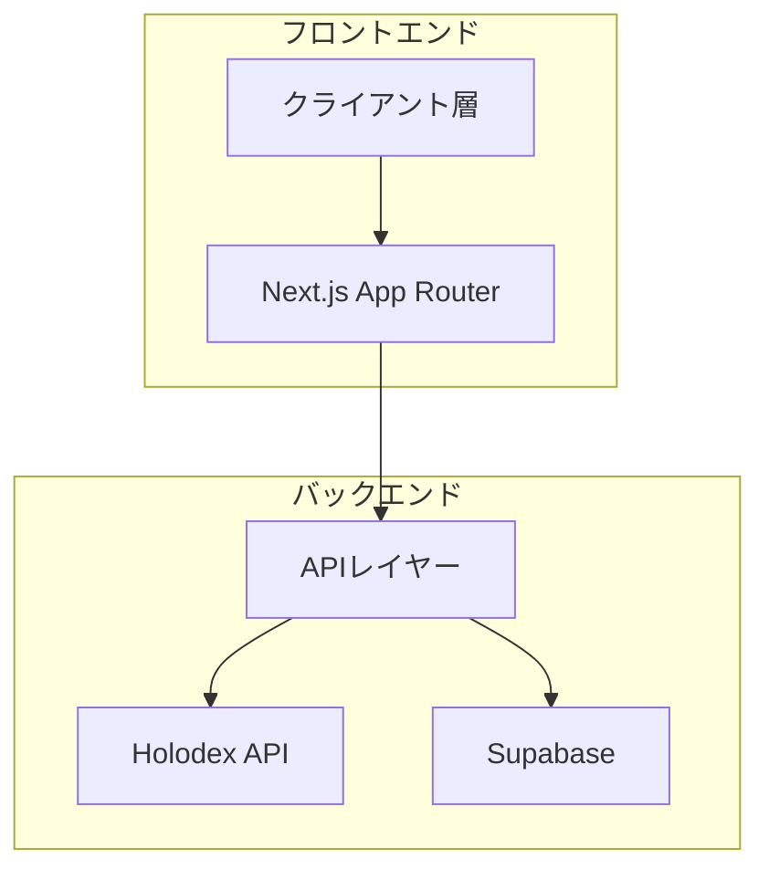
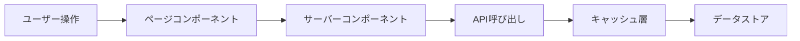

# システムパターン

## アーキテクチャ概要

## 設計原則

1. 関数型プログラミング
   - 純粋関数の優先
   - 不変データ構造の使用
   - 副作用の分離と明示
   - 型安全性の確保

2. コンポーネント設計
   - 単一責任の原則
   - 再利用可能なUIコンポーネント
   - アトミックデザインの採用
   - Propsによる明示的なデータフロー

3. 状態管理
   - サーバーサイドの状態管理
   - クライアントサイドの最小化
   - キャッシュ戦略の活用

## データフロー

## エラーハンドリング

1. 境界でのバリデーション
   - APIリクエストの検証
   - ユーザー入力の検証
   - 型チェックの活用

2. エラー表示
   - ユーザーフレンドリーなエラーメッセージ
   - デバッグ情報のログ記録
   - エラー回復の提案

## パフォーマンス最適化

1. ビルド時最適化
   - 画像の最適化
   - バンドルサイズの最小化
   - コード分割の活用

2. ランタイム最適化
   - キャッシュの活用
   - 遅延ローディング
   - ストリーミング対応

3. メトリクス監視
   - Core Web Vitals
   - エラーレート
   - パフォーマンスモニタリング
