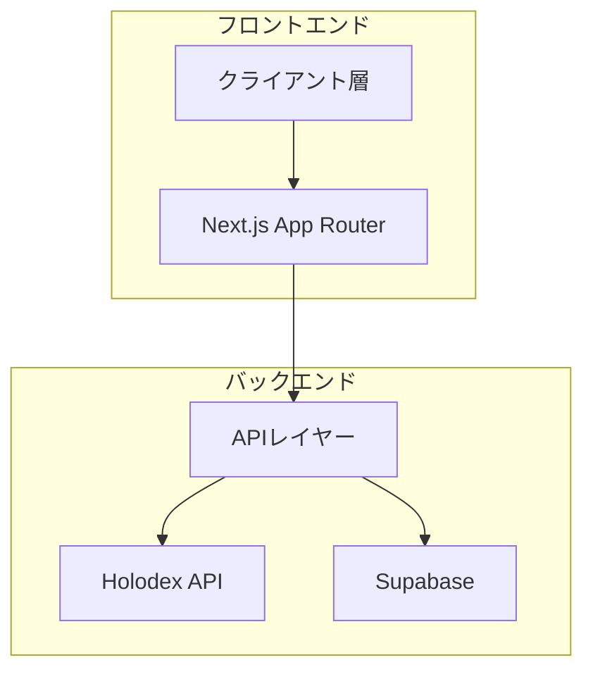
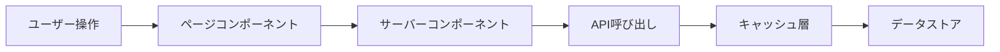

# システムパターン

## アーキテクチャ概要

```mermaid
graph TD
    Client[クライアント層] --> Next[Next.js App Router]
    Next --> API[APIレイヤー]
    API --> External[外部API]
    API --> DB[Supabase]

    subgraph "フロントエンド"
        Client
        Next
    end

    subgraph "バックエンド"
        API
        External[Holodex API]
        DB
    end
```

## 設計原則

1. 関数型プログラミング

   - 純粋関数の優先
   - 不変データ構造の使用
   - 副作用の分離と明示
   - 型安全性の確保

2. コンポーネント設計

   - 単一責任の原則
   - 再利用可能なUIコンポーネント
   - アトミックデザインの採用
   - Propsによる明示的なデータフロー
   - 情報表示のベストプラクティス
     - テキスト表示の制限（line-clamp）
     - アイコンによる視覚的情報伝達
     - 数値の適切なフォーマット（toLocaleString）
     - 条件付きレンダリングによるフォールバック
     - UI テキストの言語統一
       - 基本的に英語を使用
       - エラーメッセージ、ボタンラベル、プレースホルダーなど
       - 例外: ユーザーコンテンツ、固有名詞

3. 状態管理
   - サーバーサイドの状態管理
   - クライアントサイドの最小化
   - キャッシュ戦略の活用

## データフロー

```mermaid
graph LR
    User[ユーザー操作] --> Page[ページコンポーネント]
    Page --> Server[サーバーコンポーネント]
    Server --> API[API呼び出し]
    API --> Cache[キャッシュ層]
    Cache --> DB[データストア]
```

## エラーハンドリング

1. 境界でのバリデーション

   - APIリクエストの検証
   - ユーザー入力の検証
   - 型チェックの活用

2. エラー表示
   - ユーザーフレンドリーなエラーメッセージ
   - デバッグ情報のログ記録
   - エラー回復の提案

## テスト戦略

1. カバレッジ管理

   - `defineAppVitestConfig` の `coverageThresholds` でアプリ別に lines/statements/functions/branches のしきい値を設定
   - 初期値は「現状値 -5pt」で設定し、テスト追加に合わせて段階的に引き上げる
   - 全アプリ共通の固定値ではなく、アプリの成熟度に応じた個別値とする（voice-generator のように極端に低いアプリは未設定）

2. 外部依存のモック方針

   - Holodex API などの HTTP 依存は MSW (`test/msw/handlers.ts`, `factories.ts`) でモック
   - Supabase は `test/helpers/supabase-mock.ts` のチェーン可能モックを `setup.ts` でグローバル適用
   - YouTube IFrame API は `test/helpers/youtube-mock.ts` の `setupYouTubeApi` で `window.YT.Player` を named function ベースの `vi.fn()` として用意（`new` 呼び出しに対応）
   - WebSocket 依存（loro-sync 等）はテスト内で `vi.stubGlobal('WebSocket', MockWebSocket)` する

3. テスト容易性のためのコード設計

   - サーバー Route Handler は `NextRequest` を受け取って `NextResponse` を返す純粋関数として扱い、`new NextRequest(new URL(...))` で直接呼び出せる形を維持

## パフォーマンス最適化

1. ビルド時最適化

   - 画像の最適化
   - バンドルサイズの最小化
   - コード分割の活用

2. ランタイム最適化

   - キャッシュの活用
   - 遅延ローディング
   - ストリーミング対応

3. メトリクス監視
   - Core Web Vitals
   - エラーレート
   - パフォーマンスモニタリング
